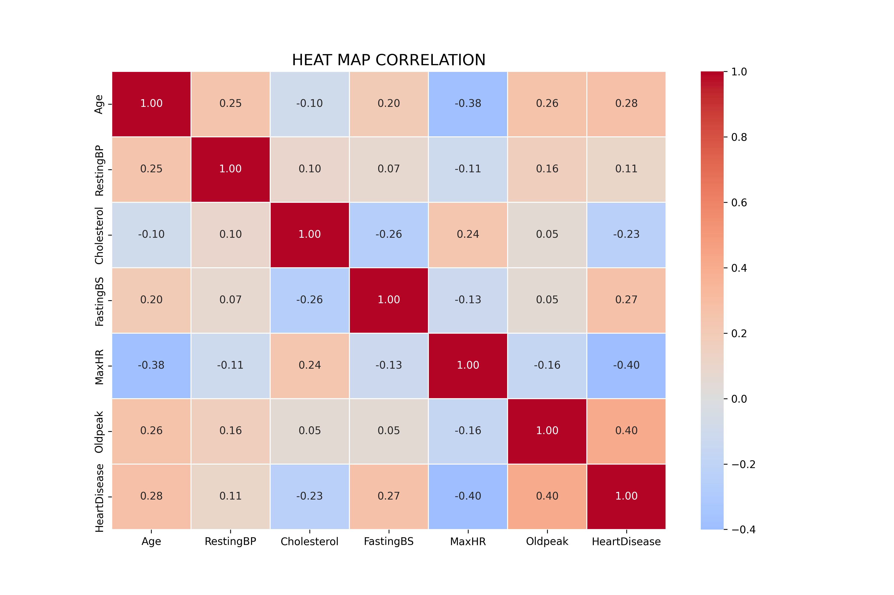
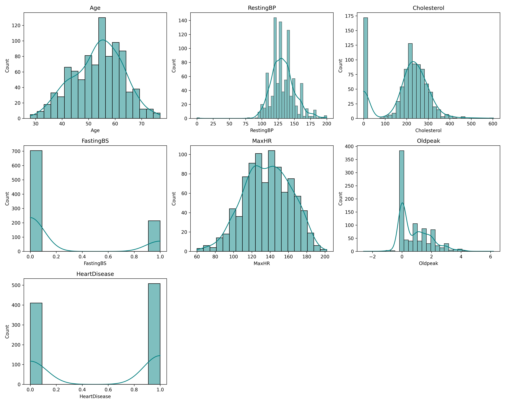
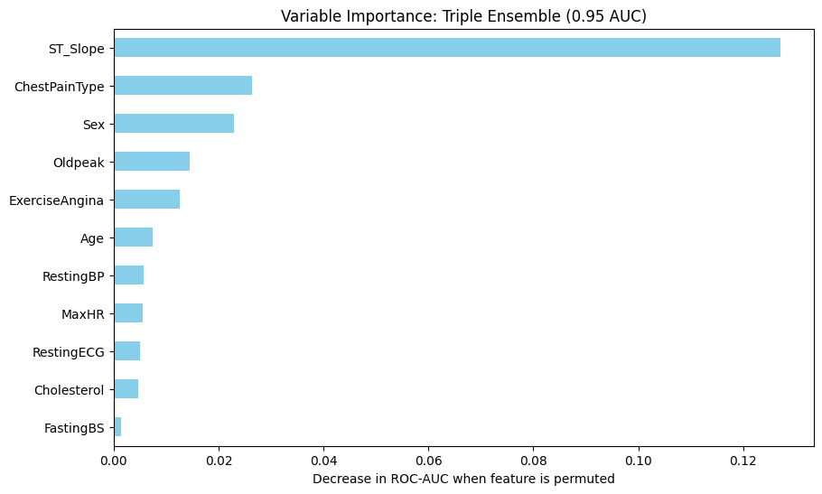
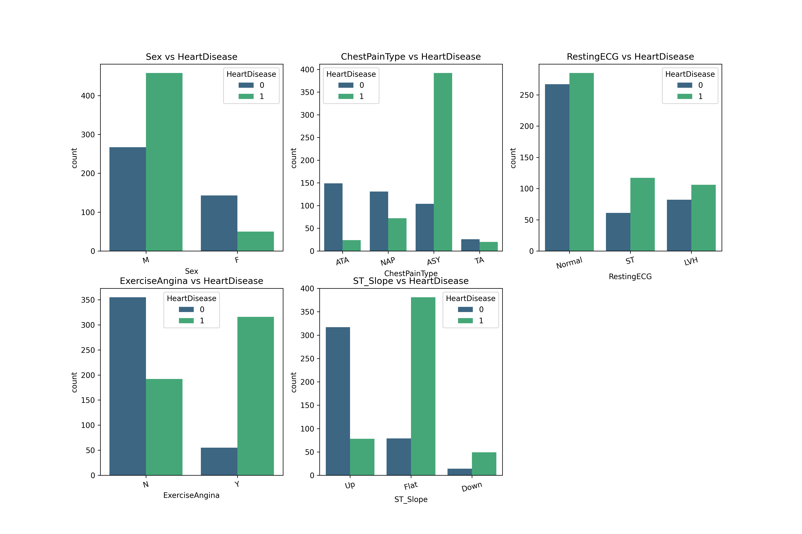

# 🫀 Heart Disease Prediction — End-to-End ML Pipeline

<p align="center">
  
  
  
  
  
</p>

<p align="center">
  <strong>🔬 A complete Data Science project showcasing the full ML lifecycle: from EDA to deployment</strong>
</p>

<p align="center">
  <a href="https://favc0608-heart-failure-prediction--data-science-proj-app-mxautc.streamlit.app/">
    
  </a>
</p>

---

## 📋 Table of Contents

- [🎯 Project Overview](#-project-overview)
- [💡 Key Highlights](#-key-highlights)
- [📊 Results Summary](#-results-summary)
- [🛠️ Tech Stack](#️-tech-stack)
- [📁 Project Structure](#-project-structure)
- [🚀 Quick Start](#-quick-start)
- [📈 Methodology](#-methodology)
- [🔍 Model Comparison](#-model-comparison)
- [📸 Visualizations](#-visualizations)
- [🎓 Skills Demonstrated](#-skills-demonstrated)
- [📝 Future Improvements](#-future-improvements)
- [📫 Contact](#-contact)

---

## 🎯 Project Overview

**Cardiovascular diseases (CVDs)** are the **#1 cause of death globally**, claiming approximately **17.9 million lives annually** (31% of all deaths worldwide). Early detection is critical for prevention and treatment.

This project builds a **machine learning pipeline** to predict heart disease risk using clinical indicators, achieving **~95% ROC-AUC** with a stacking ensemble model.

### 🏥 Business Impact
| Metric | Value | Significance |
|--------|-------|--------------|
| **Recall** | 88% | Minimizes missed diagnoses (false negatives) |
| **Precision** | 85% | Reduces unnecessary interventions |
| **ROC-AUC** | 0.95 | Excellent discrimination ability |

---

## 💡 Key Highlights

✅ **End-to-end ML pipeline** — From raw data to deployed application  
✅ **5 baseline models compared** — Logistic Regression, SVC, Random Forest, Decision Tree, XGBoost  
✅ **Bayesian hyperparameter optimization** — Using Optuna (100+ trials)  
✅ **Stacking ensemble** — Combining diverse model perspectives  
✅ **Interactive web app** — Deployed on Streamlit Cloud  
✅ **Feature importance analysis** — Interpretable predictions  
✅ **Reproducible workflow** — Modular code structure  

---

## 📊 Results Summary

### 🏆 Final Model Performance

| Model | Train AUC | Test AUC | Status |
|-------|:---------:|:--------:|:------:|
| Logistic Regression (baseline) | 0.94 | 0.92 | ✅ Low overfit |
| SVC (baseline) | 0.96 | 0.93 | ✅ Low overfit |
| Random Forest (baseline) | 1.00 | 0.94 | ⚠️ Medium overfit |
| Decision Tree (baseline) | 1.00 | 0.80 | 🔴 High overfit |
| XGBoost (baseline) | 1.00 | 0.91 | 🔴 High overfit |
| **🥇 Stacking Ensemble (tuned)** | **0.97** | **0.94** | ✅ **Best model** |

> The stacking ensemble combines Logistic Regression + Random Forest + SVC with a meta-learner, achieving robust generalization.

---

## 🛠️ Tech Stack

<table>
<tr>
<td><strong>Category</strong></td>
<td><strong>Technologies</strong></td>
</tr>
<tr>
<td>📊 Data Processing</td>
<td>Pandas, NumPy</td>
</tr>
<tr>
<td>🤖 Machine Learning</td>
<td>Scikit-learn, XGBoost</td>
</tr>
<tr>
<td>⚙️ Hyperparameter Tuning</td>
<td>Optuna (Bayesian Optimization)</td>
</tr>
<tr>
<td>📈 Visualization</td>
<td>Matplotlib, Seaborn</td>
</tr>
<tr>
<td>🌐 Deployment</td>
<td>Streamlit</td>
</tr>
<tr>
<td>💾 Model Persistence</td>
<td>Joblib</td>
</tr>
</table>

---

## 📁 Project Structure

```
heart-failure-project/
│
├── 📊 data/
│   ├── raw/                    # Original dataset
│   └── processed/              # Cleaned data (heart_clean.csv)
│
├── 📓 notebooks/
│   ├── eda1.ipynb             # Exploratory Data Analysis
│   ├── processing.ipynb       # Data preprocessing pipeline
│   └── models.ipynb           # Model training & evaluation
│
├── 🔧 src/
│   ├── models.py              # ML functions (training, tuning, stacking)
│   └── visualizations.py      # Plotting utilities
│
├── 🤖 model/
│   └── modelo_heart_disease_stacking.pkl  # Saved production model
│
├── 📈 reports/
│   ├── figures/               # Generated visualizations
│   └── tables/                # Binning analysis reports
│
├── 🌐 app.py                  # Streamlit web application
├── 📋 requirements.txt        # Dependencies
└── 📖 README.md
```

---

## 🚀 Quick Start

### 1️⃣ Clone the repository
```bash
git clone https://github.com/YOUR_USERNAME/heart-failure-project.git
cd heart-failure-project
```

### 2️⃣ Create virtual environment
```bash
python -m venv venv
source venv/bin/activate  # Linux/Mac
venv\Scripts\activate     # Windows
```

### 3️⃣ Install dependencies
```bash
pip install -r requirements.txt
```

### 4️⃣ Run the Streamlit app
```bash
streamlit run app.py
```

### 5️⃣ Or explore the notebooks
```bash
jupyter lab
# Open notebooks/models.ipynb
```

---

## 📈 Methodology

```
┌─────────────────────────────────────────────────────────────────┐
│                    ML PIPELINE WORKFLOW                         │
├─────────────────────────────────────────────────────────────────┤
│                                                                 │
│  1. DATA LOADING          2. PREPROCESSING                      │
│  ┌──────────────┐        ┌──────────────────────┐              │
│  │ heart.csv    │───────▶│ • Handle missing     │              │
│  │ (918 rows)   │        │ • Scale numerics     │              │
│  └──────────────┘        │ • Encode categoricals│              │
│                          └──────────┬───────────┘              │
│                                     │                          │
│  3. BASELINE MODELS                 ▼                          │
│  ┌─────────────────────────────────────────────┐               │
│  │ LogReg │ SVC │ RF │ DecisionTree │ XGBoost  │               │
│  └─────────────────────────────────────────────┘               │
│                          │                                     │
│  4. HYPERPARAMETER       ▼                                     │
│     OPTIMIZATION    ┌─────────────┐                            │
│                     │   OPTUNA    │ 100+ trials                │
│                     │  Bayesian   │                            │
│                     └──────┬──────┘                            │
│                            │                                   │
│  5. ENSEMBLE              ▼                                    │
│     STACKING       ┌──────────────┐                            │
│                    │ LR + RF + SVC│                            │
│                    │   ───────    │                            │
│                    │  Meta-LR     │                            │
│                    └──────┬───────┘                            │
│                           │                                    │
│  6. DEPLOYMENT            ▼                                    │
│                    ┌──────────────┐                            │
│                    │  Streamlit   │                            │
│                    │   Web App    │                            │
│                    └──────────────┘                            │
└─────────────────────────────────────────────────────────────────┘
```

---

## 🔍 Model Comparison

### Baseline vs Tuned Performance

| Stage | Model | ROC-AUC | Notes |
|-------|-------|:-------:|-------|
| Baseline | Logistic Regression | 0.92 | Simple, interpretable |
| Baseline | SVC | 0.93 | Good generalization |
| Baseline | Random Forest | 0.94 | Captures non-linearity |
| **Tuned** | Logistic Regression | 0.92 | Optuna optimized |
| **Tuned** | Random Forest | 0.94 | Reduced overfitting |
| **Final** | **Stacking Ensemble** | **0.935** | **Production model/ Reduced overfitting** |


---

## 📸 Visualizations

### Feature Correlation Heatmap
<p align="center">
  
</p>

### Numerical Features vs Target
<p align="center">
  
</p>

### Feature Importance (Ensemble)
<p align="center">
  
</p>

### Categorical Features vs Target
<p align="center">
  
</p>

---

## 🎓 Skills Demonstrated

| Area | Skills |
|------|--------|
| **Data Engineering** | Data cleaning, feature engineering, preprocessing pipelines |
| **Machine Learning** | Classification, ensemble methods, cross-validation |
| **Hyperparameter Tuning** | Bayesian optimization with Optuna |
| **Model Evaluation** | ROC-AUC, precision-recall, confusion matrix analysis |
| **MLOps** | Model serialization, pipeline design, deployment |
| **Software Engineering** | Modular code, documentation, reproducibility |
| **Data Visualization** | Matplotlib, Seaborn, interpretability plots |
| **Web Development** | Streamlit interactive applications |

---

## 📝 Future Improvements

- [ ] 🔬 Add SHAP values for individual prediction explanations
- [ ] 📊 Implement calibration plots (Platt scaling)
- [ ] 📱 Create API endpoint with FastAPI

---

## 📫 Contact

<p align="center">
  <a href="https://www.linkedin.com/in/frank-alexander-vargas-chavez-664980381/">
    
  </a>
  <a href="mailto:frankvargaschavez201@gmail.com">
    
  </a>
  <a href="https://github.com/favc0608">
    
  </a>
</p>

---

## 📚 Dataset Information

**Source:** [UCI Machine Learning Repository](https://archive.ics.uci.edu/ml/machine-learning-databases/heart-disease/) via Kaggle

Combined from 5 heart disease datasets:
- Cleveland (303 obs.)
- Hungarian (294 obs.)
- Switzerland (123 obs.)
- Long Beach VA (200 obs.)
- Stalog Heart (270 obs.)

**Final dataset:** 918 observations, 11 clinical features

### Feature Description

| Feature | Description | Type |
|---------|-------------|------|
| Age | Patient age in years | Numeric |
| Sex | M: Male, F: Female | Categorical |
| ChestPainType | TA, ATA, NAP, ASY | Categorical |
| RestingBP | Resting blood pressure (mm Hg) | Numeric |
| Cholesterol | Serum cholesterol (mg/dl) | Numeric |
| FastingBS | Fasting blood sugar > 120 mg/dl | Binary |
| RestingECG | Normal, ST, LVH | Categorical |
| MaxHR | Maximum heart rate achieved | Numeric |
| ExerciseAngina | Exercise-induced angina (Y/N) | Binary |
| Oldpeak | ST depression | Numeric |
| ST_Slope | Up, Flat, Down | Categorical |
| **HeartDisease** | **Target: 0 = Normal, 1 = Disease** | **Binary** |

---

<p align="center">
  <strong>⭐ If you found this project useful, please consider giving it a star! ⭐</strong>
</p>

